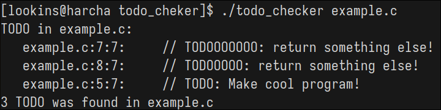

# TODO checker

Simple command line tool for checking TODOs in files.

<p align=center>
  
</p>

## Building
```console
$ git clone https://github.com/wakozim/autostereograms.git
$ gcc -O3 -Wall -Wextra -o todo_checker todo_checker.c
$ ./todo_checker
```
